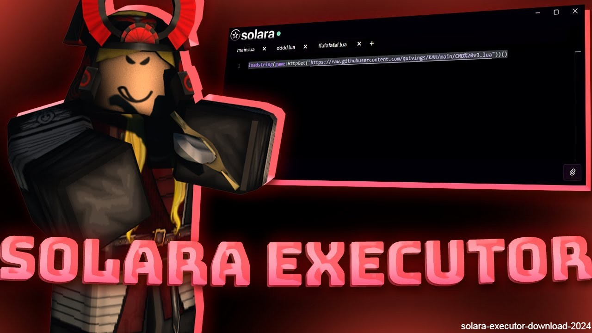

# 🌟 Solara-Executor 🌟  

Welcome to **Solara-Executor** — your ultimate tool for Roblox scripting! 🚀  
Unleash your creativity, automate tasks, and make your gameplay more fun and exciting. 🎮  

---

## ✨ Features  

- 🖥️ **Intuitive Interface**: Simple and clean for quick script execution.  
- 📂 **Script Management**: Easily load, edit, and organize scripts.  
- ⚡ **Performance Boost**: Executes scripts smoothly without lag.  
- 🎛️ **Customizability**: Supports various script types to suit your needs.  
- 🔒 **Safety First**: Built-in mechanisms to ensure secure script execution.  

---

## 🛠️ Installation  

### Requirements  
- 🖥️ Windows 10/11  
- ⚙️ .NET Framework 4.7 or higher  
- 🎮 Roblox account  

### Steps  
1. 📥 **Download**: Clone or download the repository.  
2. 🗂️ **Extract Files**: Unzip the downloaded folder.  
3. 🛠️ **Run the Installer**: Double-click `Solara-Executor-Setup.exe`.  
4. ✅ **Follow Instructions**: Complete the setup process.  

---

## 🎮 How to Use  

1. Open **Solara-Executor**. 🖥️  
2. Click **Load Script** to add your script. 📜  
3. Attach the executor to your Roblox session. 🔗  
4. Hit **Execute** and see the magic happen! ✨  
5. Manage your scripts with ease in the **Script Manager**. 📂  

---

## ❓ FAQ  

### Is Solara-Executor safe? 🔒  
Yes, but always use scripts from trusted sources to avoid risks.  

### Is it free? 🆓  
Absolutely! Solara-Executor is free and open-source.  

### Can I load custom scripts? 🎛️  
Yes, you can use various scripts to customize your experience.  

---

## 💡 Contribute  

Do you have cool ideas or found a bug? 🐞  
1. 🍴 Fork the repository.  
2. 🛠️ Make your changes.  
3. 🔄 Submit a pull request!  

---

## ⚠️ Disclaimer  

Solara-Executor is for educational purposes only. 🧠  
Please respect Roblox's terms of service and use responsibly. 🙏  

---

## 📜 License  

Licensed under the **MIT License**. See the `LICENSE` file for details.  

---

🌟 **Enjoy exploring Roblox with Solara-Executor!** 🚀  
If you need help, check the issues section or reach out via GitHub. 💬  
